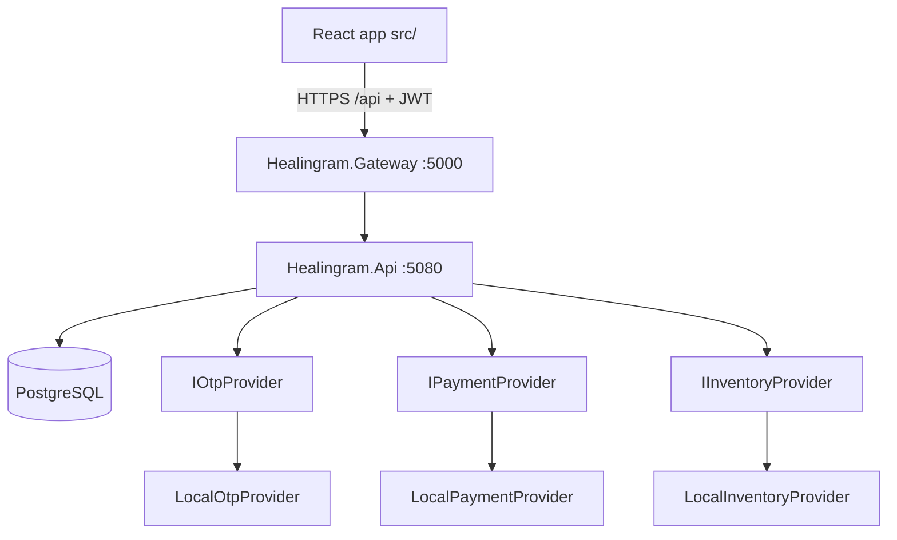

# Architecture overview

Last reviewed: 13 September 2026, branch `feature/v1-final-foundation-release-readiness`.

This is the canonical system picture. Journey detail lives in `docs/po-flows/` and `docs/technical-flows/`. Module detail: [architecture-modules.md](architecture-modules.md). Auth: [engineering/security-and-authorization.md](engineering/security-and-authorization.md).

## System context

Healingram is a programme-led retreat marketplace. A guest does not buy a hotel night. They pick a published programme, request availability, and pay only after the retreat (or Healingram admin, in demo) confirms. PostgreSQL is the only business source of truth.

## Frontend

- Canonical UI: `src/` (React + Vite).
- `ui-reference/` is design-only. Do not treat it as product code.
- The frontend holds component/form/query state and `sessionStorage` tokens.
- It does **not** authoritatively store retreats, programmes, needs, bookings, payments, or vendor queues.
- Catalogue browse requests one page (`page`, `pageSize=24`). Matching uses retreat cards returned by the matching API.

## Backend

One .NET modular monolith. Modules own schemas and HTTP routes. They talk through contracts (`Healingram.Contracts`), never by reading another module’s tables.

Gateway (YARP) is the public door: CORS, correlation ID, proxy. No business writes.

## Database

One Postgres. Schema-per-module. Migrations: `backend/db/001_*.sql` … `014_*.sql`, ledger `public.schema_migrations`, session advisory lock on startup. See [database-schema.md](database-schema.md).

## Authentication and authorization

Four session kinds: anonymous, `guest_request`, registered customer, partner/admin JWT. Vendor sessions are issued only after an active partner membership (admins excepted). See the security doc.

## Provider abstractions

Application code depends on `IOtpProvider`, `IPaymentProvider`, `IInventoryProvider`. Startup selects the implementation. Unknown or unimplemented production names fail start. There is no silent fallback to local adapters. See [provider-architecture.md](provider-architecture.md).

## Events and notifications

Cross-module side effects go through `notifications.outbox`. User-visible messages use `notifications.inbox`. Audit rows go to `audit.events`. Correlation IDs travel on `X-Correlation-Id`.

## Observability

Serilog → Seq (local). OpenTelemetry → Jaeger (local). Never log passwords, OTP values, tokens, or provider secrets.

## Deployment

Local: API :5080, gateway :5000, Vite :5173, Postgres :5432. Docker Compose in `infra/`. Production shape: static frontend + gateway + API + managed Postgres. See [deployment-guide.md](deployment-guide.md).
